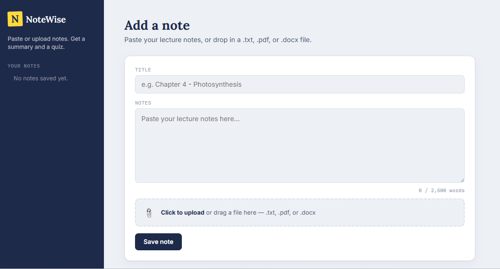

# 📘 NoteWise

### a. What it does & the problem it solves

NoteWise is a study tool for students. Before an exam, students often have long,
messy lecture notes and no quick way to check if they actually understood the
material. NoteWise lets a student paste or upload their raw notes and instantly get:

- A clean, highlighter-style **summary** of the key ideas
- A **5-question practice quiz** (multiple choice) generated from those exact notes,
  so they can self-test before moving on

**Who it's for:** students (school, college, university) who want a faster way to
review and self-test on their own notes, instead of re-reading everything passively.

### b. Live URL

🔗 **[https://notewise-nine.vercel.app](https://notewise-nine.vercel.app)**

### c. Features

- Add a note by **pasting text**, or **uploading a file** (`.txt`, `.pdf`, or `.docx`) — drag-and-drop supported
- File text is extracted entirely in the browser (nothing is uploaded to a server)
- Notes are saved automatically in the browser (localStorage) so they persist between visits
- View, switch between, and delete saved notes from the sidebar
- Generate an AI summary + quiz for any note with one click
- Take the quiz interactively — select an answer per question (scantron-style bubbles)
- Get instant scoring (X / 5) with correct/incorrect answers highlighted
- Live word-count guard that warns before a note is too long for the AI to process
- Fully responsive layout (works on mobile)
- Custom "study desk" visual design — ruled-paper notes, highlighter-marker summaries

### d. The AI feature

**What it does:** Takes the raw lecture notes (typed or extracted from an uploaded
file) and sends them to Groq's API (running Llama 3.3 70B), which returns a
structured summary and a 5-question quiz in JSON, rendered as an interactive quiz.

**The exact system prompt used** (see `app/api/generate/route.js`):

```
You are NoteWise, a study assistant for students.
You will be given raw lecture notes, which may be messy, incomplete, or informal.

Your job is to return ONLY valid JSON (no markdown, no code fences, no extra text) with this exact shape:

{
  "summary": ["bullet point 1", "bullet point 2", "..."],
  "quiz": [
    { "question": "...", "options": ["A", "B", "C", "D"], "answer": "the correct option text" }
  ]
}

Rules:
- "summary" should have 4-8 concise bullet points capturing the key ideas, in simple language.
- "quiz" should have exactly 5 multiple-choice questions that test understanding of the notes.
- Each question must have exactly 4 options, and "answer" must exactly match one of the options.
- Do not invent facts that aren't supported by the notes.
- If the notes are too short or empty to work with, still return valid JSON with an empty summary array and empty quiz array.
- Output must be strictly valid JSON. Do not wrap it in backticks or add any commentary.
```

### e. Tools, services, and AI models used

- **Framework:** Next.js 14 (App Router) — frontend + backend API route in one project
- **AI model:** Llama 3.3 70B via the free Groq API
- **File parsing:** `pdfjs-dist` (PDF text extraction) and `mammoth` (DOCX text extraction), both running client-side
- **Storage:** Browser `localStorage` (no external database needed)
- **Hosting:** Vercel (free tier)
- **Version control:** GitHub (public repo)

### f. Screenshots




### g. How to run this project locally

**Requirements:** Node.js 18+ installed

```bash
# 1. Clone the repo
git clone https://github.com/numanahmadmkd4-a11y/notewise.git
cd notewise

# 2. Install dependencies
npm install

# 3. Add your Groq API key
cp .env.example .env
# then open .env and paste your key:
# GROQ_API_KEY=your_key_here

# 4. Run locally
npm run dev
```

Then open [http://localhost:3000](http://localhost:3000) in your browser.

**Get a free Groq API key:** go to [https://console.groq.com/keys](https://console.groq.com/keys),
sign in, and click "Create API Key". No credit card required.
